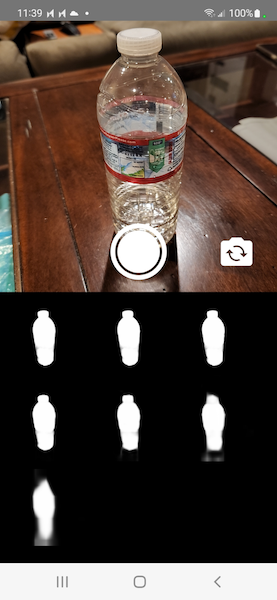
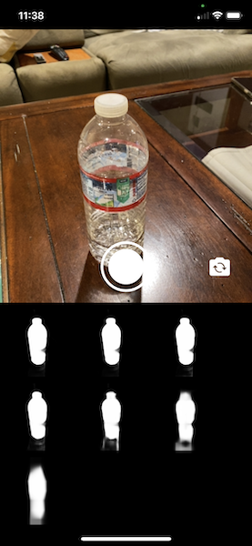

# UNet Example

The repository contains code for a [PyTorch Live](https://pytorch.org/live) salient object detection prototype. The prototype uses the [u2netp model](https://github.com/xuebinqin/U-2-Net) for the salient object detection task and runs on-device. It runs on Android and iOS.

## How was this project bootstrapped?

The project was bootstrapped with the following command:

```
npx torchlive-cli init UNetExample --template react-native-template-pytorch-live
```

Unused packages were removed and `react-native` upgraded to version `0.64.3`.

# Screenshots

|Android|iOS|
| --------------------- | --------------------- |
|||

# Run project in emulator or on a device

## Prerequisites

Install React Native development depencencies. Follow the instructions for [Setting up the development environment](https://reactnative.dev/docs/environment-setup) as provided on the React Native website.

## Install project dependencies

Run `yarn install` to install the project dependencies.

## Start Metro server

Start the Metro server, which is needed to build the app bundle (containing the transpiled TypeScript code in the `<PROJECT>/src` directory).

```
yarn start
```

## Android

Build the `apk` for Android and install and run on the emulator (or on a physical device if connected via USB).

```
yarn android
```

See instructions on the React Native website for how to build the app in release variant.

## iOS

Install CocoaPod dependencies

```shell
(cd ios && pod install)
```

Build the prototype app for iOS and run it in the simulator.

```shell
yarn ios
```

or use the following command to open the Xcode workspace in Xcode to build and run it.

```shell
xed ios/UNetExample.xcworkspace
```

See instructions on the React Native website for how to build the app in release scheme.